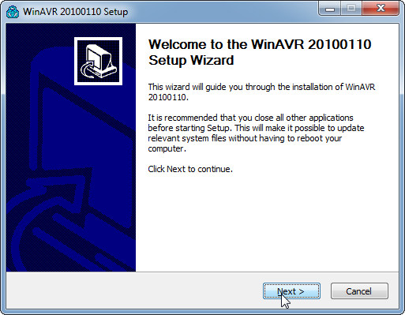

This document describes the processing of installing WinAVR 20100110 on a Windows 7 PC and configuring it for use with an AVR Dragon programmer for an ATMega328-PU target..

# Installing WinAVR#

## Downloading##

Size: 18 MB

[Installer File](https://sourceforge.net/projects/winavr/files/WinAVR/20100110/WinAVR-20100110-install.exe/download)

## Installation Steps##

1) Run the installer you downloaded (WinAVR-20100110-install.exe)

2) Click 'OK' when it prompts you to select 'English' as your language

3) Click 'Next' on the Welcome window

4) Agree to the licenses by clicking 'I Agree'

5) Keep the default Destination Folder by clicking 'Next'

6) Accept the default Installation Components by clicking 'Install'

7) Wait as the installation commences

8) When the installation is complete, click on 'Finish'

## Verifying Installation##

1) Open a Command Prompt as an Administrator by:
	1) Clicking on the Start Menu
	2) Typing 'cmd' in the Run dialog
	3) Right-clicking on the resulting entry for 'Command Prompt' and,
	4) Clicking on 'Run As Administrator'
	5) Then clicking on 'Yes' in the UAC dialog that appears
	

2) In the command prompt type 'avr-gcc' and hit Return

3) Verify that the result is:

	avr-gcc: no input files

# Using avrdude#

avrdude is the utility that allows you to program AVR chips.
This is the command line that I use to program the ATMega328P with an AVR Dragon programmer:

	avrdude -p m328p -c dragon_isp -P usb -v
	
The options are:

* -p m328p - Sets the processor to ATMega328P
* -c dragon_isp - Specifies that the programmer is the AVR Dragon in ISP mode
* -P usb - Specifies that the AVR Dragon is connected via USB
* -v - Verbose output

## Using the AVR Dragon with avrdude##

It is not straightforward to use the AVR Dragon with avrdude for two reasons:

* The drivers will need to be installed
* A libusb-win32 INF filter will need to be installed

### AVR Dragon Drivers###

The AVR Dragon USB drivers can be downloaded from Atmel's site after providing your contact information. 
The URL is [http://www.atmel.com/System/BaseForm.aspx?target=tcm:26-66206](http://www.atmel.com/System/BaseForm.aspx?target=tcm:26-66206)

The driver shouldn't pose any issues when installing, but you may need to reboot.

###libusb-win32 Driver Filter###

Even after the driver is installed avrdude will not be able to access the Dragon. This is because 
avrdude uses libusb to access the Dragon. To allow avrdude to access the Dragon you will have to
download libusb-win32 from here:

[http://sourceforge.net/projects/libusb-win32/files/latest/download](http://sourceforge.net/projects/libusb-win32/files/latest/download)

1) Once downloaded, unzip the file into a temporary directory and find the 'bin' directory.

2) Within that directory there are two subdirectories which both contain an 'install-filter.exe' file. Run the 'install-filter-win.exe' program from the directory appropriate for your architecture:

* 64-bit Windows - 'amd64'
* 32-bit Windows - 'x86'
	
3) Ensure that 'Install a Device Driver' is selected and click 'Next'

4) Find the 'AVR Dragon' entry in the list, select it and click 'Install'

5) A dialog will quickly pop up and then this dialog or a similar one should appear. Click 'OK'

6) You will be returned to the driver list screen - click 'Cancel' to exit.

7) Verify the installation:

	1) Connect the Dragon via USB

	2) Open a Command Prompt

	3) Type 'avrdude -p m328p -c dragon_isp -P usb -via

You should see a screen with text similar to this (there may be more text, but at least this text):

> 	avrdude: Version 5.10, compiled on Jan 19 2010 at 10:45:23
>          Copyright (c) 2000-2005 Brian Dean, http://www.bdmicro.com/
>          Copyright (c) 2007-2009 Joerg Wunsch
> 
>          System wide configuration file is "C:\WinAVR-20100110\bin\avrdude.conf"
> 
> 
>          Using Port                    : usb
>          Using Programmer              : dragon_isp
>	 avrdude: usbdev_open(): Found AVRDRAGON, serno: 00A200006230
> 	JTAG ICE mkII sign-on message:
> 	Communications protocol version: 1
> 	M_MCU:
> 	  boot-loader FW version:        255
> 	  firmware version:              7.24
> 	  hardware version:              1
> 	S_MCU:
> 	  boot-loader FW version:        255
> 	  firmware version:              7.24
> 	  hardware version:              6
> 	Serial number:                   00:a2:00:00:62:30
> 	Device ID:                       AVRDRAGON

## Fixing the ATMega328P Chip ID##

Apparently the ATMega328-PU has a slightly different device signature from the 
ATMega328P. If you don't use the -F option on the avrdude command line then you
won't be able to program the chip. Using the -F option is dicey because if something *else*
goes wrong then you might brick a chip.

This site details the nature of the problem and the fix:

[http://www.instructables.com/id/Bootload-an-ATmega328/step6/ATmega328-PU-workaround/](http://www.instructables.com/id/Bootload-an-ATmega328/step6/ATmega328-PU-workaround/)

The steps to fix this are:

1) Open the following file in Notepad++ or equivalent:
	C:\WinAVR-20100110\bin\avrdude.conf
	
2) Search for: "0x1e 0x95 0x0F" (this is the ATmega328P signature)

3) Replace it with: "0x1e 0x95 0x14" (this is the ATmega328-PU signature)

4) Save the file

To undo the steps, switch the two HEX signatures and save the file.

## Working With Fuse Bits##

Do not attempt to configure fuses without this site: [http://www.engbedded.com/fusecalc/](http://www.engbedded.com/fusecalc/)

The configuration I chose is:

* Internal RC Oscillator 8MHz; 
* Start-up time PWRDWN/RESET: 6CK/14CK + 65 ms; [CKSEL=0010 SUT=10]; default value
* Clock output on PORTB0 NOT SELECTED
* Divide clock by 8 internally NOT SELECTED
* Boot Reset vector Enabled NOT SELECTED
* Boot Flash section size=2048 words Boot start address=$2800; [BOOTSZ=00]; default value
* Preserve EEPROM memory through the Chip Erase cycle; EESAVE=0 NOT SELECTED
* Watch-dog Timer always on [WDTON=0] NOT SELECTED
* Serial program downloaing (SPI) enabled [SPIEN=0] SELECTED
* Debug Wire enable [DEN=0] NOT SELECTED
* Reset Disabled (enable PC6 as I/O pin); [RSTDISBL=0] NOT SELECTED
* Brown-out detection disable; [BODLEVEL=111]

This is the command line that the site generated for me:

	-U lfuse:w:0xe2:m -U hfuse:w:0xd9:m -U efuse:w:0xff:m

However, this command line will produce an error because the extended fuses will be read as 0x07
rather than 0xFF. This is actually fine, but to prevent the error, use this command line:

	-U lfuse:w:0xe2:m -U hfuse:w:0xd9:m -U efuse:w:0x07:m

## Using avrdude in a Makefile##

The one issue I've seen using avrdude in a makefile is that the Dragon needs a 'recovery' time
after an operation with it. If it is not allow 1-2 seconds between avrdude calls, the second
avrdude call will not find the Dragon and will fail. 

In Windows, this can be accomplished by adding the following line between any avrdude calls:

	sleep 2

Keep in mind that multiple write and reads can be chained in one avrdude command line via multiple
-U switches being passed to avrdude. This often mitigates this issue with.