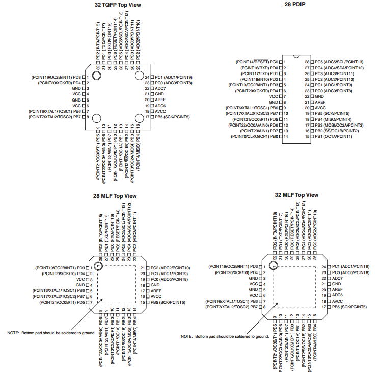

## Downloads

**[TinyCAD Latest Version Download Page](http://sourceforge.net/projects/tinycad/files/latest/download)**

**[Alternate TinyCAD Libraries](https://github.com/sfriederichs/TinyCAD-Libraries/archive/master.zip)**

## Introduction

TinyCAD is my preferred schematic capture program.  This is entirely a personal preference and doesn't match the preferences as a whole of the 'Maker' community, professional engineers or sane people.  That being said I have a process that allows me to make things and TinyCAD is a part of it.  If you want to make things like I do then follow these steps to get on your way.

## Installation

TinyCAD is hosted on SourceForge so it's always easy to get the latest version:

**[TinyCAD Latest Version Download Page](http://sourceforge.net/projects/tinycad/files/latest/download)**

**Note to Windows Vista users and above**: As of December 2009 (and for reference I'm writing this in January 2013 so it may be fixed - I have no Vista or above to test it out) TinyCAD had [issues](http://uk.groups.yahoo.com/group/tinycad/message/1743) regarding new user permissions when running as a User rather than Administrator in Windows Vista and above. This is mainly due to the location in which TinyCAD by default chooses to store its library files.  If you follow this guide you will download a different set of libraries and install them to a different location in a directory where Users have the correct permissions.  If you don't download these libraries please move the TinyCAD default libraries from the Program Files\TinyCAD\library to a location under My Documnets or another folder a User will have full permissions to.

**Note to Windows 8 users**: As of December 2012 there was an [issue](http://uk.groups.yahoo.com/group/tinycad/message/3225) with TinyCAD version 2.80.05 build 619 on Windows 8 where users would be unable to open and save files except by dragging the files onto the TinyCAD application and using _Save As_ instead of _Save_.  As far as I know these issues may be ongoing and Windows 8 is not the best operating system on which to run TinyCAD.

The installer is self-extracting and will pretty much install itself once you run it.  You'll get several screens:

Clicking _Next_ will take you to this screen where you agree to the license (GPL v2 I believe):

Then all you have to do is select the installation directory - the default should be fine but read the note above if you have any Windows above XP.

The actual installation takes almost no time on my computer.  Then it asks if you want to run TinyCAD:

## Library Installation

You can start to use TinyCAD with the default libraries or you can download the latest version of the libraries that I use.  TinyCAD by default ships with a rather old set of disorganized libraries combined with a new set of more organized libraries.  Ideally they would choose one or the other but such is life.  The newer, more organized set of libraries can be downloaded by themselves from Github:

**[Alternate TinyCAD Libraries](https://github.com/sfriederichs/TinyCAD-Libraries/archive/master.zip)**

I prefer to download this set of libraries and use only them, but it's a matter of preference.  Most people rely on making their own symbols anyhow.

If you click on that link it will download the whole repository containing the TinyCAD libraries.  The actual libraries are stored in a subdirectory of the ZIP file: \Libraries\TCLib

This directory contains many .TCLib files.  Create a new directory under My Documents - call it something like TinyCAD Libraries.  Copy all of the .TCLib files there.

Now you need to add all of these new libraries to TinyCAD and remove the old ones.  Start up TinyCAD and you should see a screen like this:

The mouse pointer is centered on the _Libraries_ button - click it to open this dialog:

You'll have to manually remove each library that's in the dialog - yep, one at a time.  Select, then _Remove_, then select, then _Remove_.  Do this until the whole library dialog is empty:

Now you can start adding the libraries in your My Documents\TinyCAD Libraries folder:

And continue until you've added all of them or as many of them as you want.

## Parts Development

More often than not you'll find that a part you need doesn't exist in the libraries.  This is regrettable but normal - even if you have a 'real' engineering job you'll find that this is often the case.  Drawing your own symbols is a necessary part of schematic capture.  

### Library Generation

You should in general add all new symbols to one library - your personal library.  Alternatively you can try to organize all of symbols into logical groups.  For example in the alternate TinyCAD libraries discussed above the library organization falls into a Type/Group/Part organization.  For example the _sm_IC_Transceivers.TCLib_ is Surface Mount (sm) / Integrated Circuit (IC) / Transceivers, _gen_Passives.TCLib_ is Generic (gen) / Passives. This is the group for passive devices like resistors and capacitors and inductors that are not specifically through hole or surface-mount parts - just schematic symbols. 

You can attempt an organization like that but I would recommend just using a single library for all of the parts you generate - until it becomes too large and difficult to organize.

In TinyCAD open up the _Libraries_ dialog and click on _New_:

You'll be prompted to enter a name and location for your personal library.  Call it whatever you like and put it in the same directory as the other library files:

Now your library shows up in the list of libraries in TinyCAD.  

### New Part Generation

Select your new library and click on the _Edit_ button:

This will bring up a largely blank screen - your library is empty.  Right-click on the blank space and select _New Symbol_ in the menu:

A drawing canvas will come up.  This is where you will draw the part. Before you start some settings have to be changed to save grief later on in the process.  On the menu bar select _Options->Settings_:

The _Settings_ dialog will open.  The settings we're interested in are:

* Show the Grid: On
* Snap to Grid: On
* Grid Spacing: Fine

Here is what the dialog should look like before you hit _OK_:

These grid settings will help ensure that the pins on the symbol you generate end up on the grid when you use them in a design.  **This is a very important step!**  You'll be terribly frustrated if you don't do this!

Now you can start drawing your part.  There are three types of things you can have on the canvas when generating a part:

* Polygons/Lines - These are what you use to draw the part.  TinyCAD supports arcs, circles, rectangles and generic closed polygons. Polygons can be filled with a variety of colors or patterns for flavor. Both polygons, lines and arcs allow line width, color and pattern can also be customized.  
* Text - Generic text with support for multiple fonts, styles (bold, italics, etc.), sizes and text directions
* Pins - Pins are the most important aspect of generating a part because they are used in the netlists which dictate board layout and SPICE models among other things.

The most attention in this tutorial will be paid to the pins.  The other graphical options can improve the visual aspects of the part but if the pins are wrong that isn't worth very much. Feel free to investigate the myriad graphical options on your own with the knowledge that the worst you can do is make the part uglier.

The part that I will create in this tutorial is the LM7805 TO-220 Package 5V Voltage Regulator.  The first place to start [the datasheet](https://github.com/angryee/light-costume/blob/master/ExtRef/LM7805.pdf?raw=true).  The datasheet will provide you an example symbol and the pinouts _for the package you intend to use_. It is very important to use the correct pinout! Datasheets often cover multiple packages for the same part.  For example, note the differences in pinouts for the various packages of the ATMega328P:

A lot of packages look the same! It's easy to get confused between an SSOP package and a PDIP package on a datasheet, so don't get fooled.  

The LM7805 datasheet luckily has only one pinout:

And later in the document they show several circuits which include a schematic symbol for the LM7805:

It's nothing fancy but it will do - let's reproduce it in TinyCAD.

At this point we're still on the canvas screen where we can start drawing.  Since we're just going to reproduce the datasheet, let's start by adding in the 'LM7805' text that will go in the symbol. Click on the text icon on the toolbar:

The text toolbox comes up.  Type 'LM7805' into it:

Then click the mouse somewhere in the canvas to place the text.  Next we need to draw a box around the text, so click the rectangle button from the toolbar:

And draw an appropriately-sized rectangle around the text:

Now it's time for the pins.  From the datasheet, the pinout was:

1. Vin/Input Voltage
2. Gnd/Ground
3. Vout/Output Voltage

Start by clicking the pin button on the toolbar:

This brings up the pin toolbox where we'll put in the information for pin 1:

There are a lot of options here and this is one of the important steps, so I'll go through the options and their significance in order of importance:

* Number - This is the **most** important!  If this isn't correct then your board layout may suffer. I've had to deal with mis-numbered pins which caused my layouts to be incorrect.  This mean a whole board was essentially worthless.  Bottom line: do not screw up your pin numbers!
* Name - Important to help you keep everything straight.  If you accidentally switch two pin names you'll be very confused.
* Up/Down/Left/Right - You want to get this right so that your pin is facing the correct direction.  The rule of thumb is that the wire connection point faces the _opposite_ of the chosen direction.  So if you select Up the connection point for the pin will be on the bottom of the pin, Left means the connection point is on the right, etc.
* Electrical - This information is used by TinyCAD to perform Design Rule Checks.  While it is not strictly necessary to use this field the DRC is actually rather useful.  Most of the options here are used for digital circuits: Input, Output, Tristate and Input/Output are only useful for digital circuits.  Passive is useful for analog/passive components such as resistors and capacitors and power pins on digital ICs, but also for things like the LM7805 which has pins that don't really fit into any other category. Open Collector is useful for ICs that have open collector outputs like the ULN2803.  No Connect could be used anywhere - many ICs specify No Connect for some pins. As always, consult your part's datasheet for specifics.
* Shape - This is mainly a beautification tool.  Some pins (clock pins for example) have an alternate pin style drawn in the datasheet.  It's nice to copy this and TinyCAD has a large selection of styles to mimic the styles shown in datasheets.
* Length - Largely a style decision but take not that some oddball lengths can cause pins to not sit on the grid and will prevent you from connecting to the part.  I usually go with 15 or 30.  
* Centre pin name - You can do this if you want.  I prefer pin names inside the symbol so I leave it unchecked.
* Number pos - This only moves the position of the text which indicates the pin number.  Move it if you want.

Using the pinout from the datasheet I added all three pins as they were shown in the datasheet.  All were 30 length and Passive typed pins.  I had to increase the size of the rectangle to accommodate the text for the pin names and it ended up looking like this:

Now we're done! Go to the menu bar and select _File->Close_:

This will force a save and bring up the save dialog which you can see below.

This dialog has several important parts:

* Description - Definitely put something here.  I like to put the description of what the part does and its package in case I have multiple package types for this part.
* Reference - You can set this to any number of this - U? is somewhat generic.  Usually resistors will be R?, capacitors are C?, etc.  Make sure to include ? - this gets replaced by the reference designation number for a specific instance of this part.
* Name - I like it to include the part name and package
* Package - This is a necessary parameter to set but it's difficult to say what it should be.  It is dependent on your board layout tool. The package you put here has to be understood and supported by your board layout tool.  I'll discuss this more when I write the guide for FreePCB.  In general, put the package name in here if you don't know.

You can also add as many parameters as you like.  I tend to add things like Digi-Key part number, price per unit, electrical characteristics and so forth. Two important parameters to add for some components (such as capacitors and resistors) are Value and Tolerance.

This is the completed dialog for the LM7805 with me ready to _Store_ the part in the library:

When the dialog clears you'll see your library is no longer empty:

You've just made your first part!

## Schematic Capture

TinyCAD makes it easy to capture schematics quickly.  The schematic I'll show you how to create is a typical 5V source using an LM7805.  We'll follow the schematic provided in the LM7805 datasheet:

However, I'm also going to add an LED that will light when the 5V source is on. I'll discuss adding that in a minute.

Since I've already written up how to create libraries and parts I've provided all of the parts necessary to generate this schematic in a [library on Github](https://github.com/angryee/light-costume/blob/master/Libraries/TinyCAD/costume.TCLib?raw=true).  Just download and add the costume.TCLib library to TinyCAD as per the instructions above.  Next, in TinyCAD click on the _New_ button in the toolbar:

A blank canvas will appear where we can place all of our parts.  Open up the _costume_ library and you'll see all the parts we're going to use:

**1x LM7805_TO-220** - We can't get by without having the 5V regulator.  The TO-220 package can handle 1A of current.  The actual part looks like this:

**2x C - Generic Radial Ceramic Capacitor** - The datasheet doesn't specify any special type of capacitor and I have some ceramic radial through-holes on hand, so I went with this rather than the axial.  They look like this:

**1x R - Generic Resistor** - A generic through-hole radial resistor to bias the LED.  You've probably seen this before:

                                                                                                                                                                                                                                                                                                                                                                                                                                                                                                                                                                                                                                                                                                                                                                                                                                                                                                                                                                                                                                                                                                                                                                                                                                                                                                                                                                                                                                                                                                                                                                                                                                                                                                                                                                                                                                                                                                                                                                                                                                                                                                                                                                                                                                                                                                                                                                                                                                                                                                                                                                                                                                                                                                                                                                                                                                                                                                                                                                                                                                                                                                                                                                                                                                                                                                                                                                                                                                                                                                                                                                                                                                                                                                                                                                                                                                                                                                                                                                                                                                                                                                                                                                                                                                                                                                                                                                                                                                                                                                                                                                                                                                                                                                                                                                                                                                                                                                                                                                                                                                                                                                                                                                                                                                                                                                                                                                                                                                                                                                                                                                                                                                                                                                                                                                                                                                                                                                                                                                                                                                                                                                                                                                                                                                                                                                                                                                                                                                                                                                                                                                                                                                                                                                                                                                                                                                                                                                                                                                                                                                                                                                                                                                                                                                                                                                                                                                                                                                                                                                                                                                                                                                                                                                                                                                                                                                                                                                                                                                                                                                                                                                                                                                                                                                                                                                                                                                                                                                                                                                                                                                                                                                                                                                                                                                                                                                                                                                                                                                                                                                                                                                                                                                                                                                                                                                                                                                                                                                                                                                                                                                                                                                                                                                                                                                                                                                                                                                                                                                                                                                                                                                                                                                                                                                                                                                                                                                                                                                                                                                                                                                                                                                                                                                                                                                                                                                                                                                                                                                                                                                                                                                                                                                                                                                                                                                                                                                                                                                                                                                                                                                                                                                                                                                                                                                                                                                                                                                                                                                                                                                                                                                                                                                                                                                                                                                                                                                                                                                                                                                                                                                                                                                                                                                                                                                                                                                                                                                                                                                                                                                                                                                                                                                                                                                                                                                                                                                                                                                                                                                                                                                                                                                                                                                                                                                                                                                                                                                                                                                                                                                                                                                                                                                                                                                                                                                                                                                                                                                                                                                                                                                                                                        **1x T-1 sized LED** - Maybe it's from Radio Shack, maybe it's from an overstock house. Here's an example:

With everything placed on the canvas it should look roughly like this:

Now you have to draw the connections between the components as they are in the circuit.  Click the _Wire_ button on the toolbar:

Then, move the cursor to a pin and notice the connection bubble show:

Click on the pin and it will start a wire (also called a net) - connect it to the input of the 7805:

Then add the rest of the connections.  It will look like this in the end:

Now I'm going to add power connections. The power connections allow you to connect different nets together by adding the power connection to the net.  The ground symbol is an example - every ground is tied together.  This goes strictly by name - all nets connected to a _GND_ power connection will be considered to be connected for the purposes of the schematic.  Also, they make the schematic look cool.  Click on the _Power_ icon in the toolbar:

This brings up the _Power_ dialog where you can choose for power symbols:

I use the following symbols:

* GND - Arrow/Down
* 5V - Top/Bar
* Vin - Top/Bar

The end result looks like this:

The next step is to put values on the capacitors and resistors.  Click on the left-most capacitor - the _Properties_ dialog shows up:

Edit the _Value_ field to a value of '.33u' - 33 micro-farads - and set the _Show?_ tag to 'True' so that the value will show up on the schematic - the _Properties_ window looks like this afterwards:

When the _Value_ field is set to visible it pops up a bit far away from the capacitor, so I move it:

Then I repeat the process for the other capacitor.  As for the resistor value I just chose a value of 1K.  This will give the LED a few mA of current which should at least light it up but shouldn't suck up too much current. Doing some quick calculations and assuming a forward LED voltage of 1.7V: 5V -1.7V = 3.3V/1K = 3.3mA.  So it should light but not much - this is desirable for a power LED. All the values added look like this:

Now that all the components are placed and the values set we have to update the symbol references.  Right now the symbol references are unset: they all say _D?_ instead of _D1_.  TinyCAD can automatically set all of the references.  Start by clicking on the _Special->Generate Symbol References_.  This dialog will show up:

The default settings are fine. Click on OK and all of the symbol references will be generated and added - no more _D?_ but instead _D1_.  The only thing left now is to save it.  Click on the _Save_ button on the toolbar:

And then save it wherever you want (I'll discuss project organization later):

And that's it - you've capture your first circuit!